# CLAUDE.md

This file provides guidance to Claude Code (claude.ai/code) when working with code in this repository.

## Commands

### Build
swift build

### Test
swift test

### Run specific test
swift test --filter TestName

### Generate Protobuf files
SwiftProtobufPlugin automatically generates Swift code during build
Configuration: Sources/ActorEdgeCore/swift-protobuf-config.json

### Clean build
swift package clean

## Architecture Overview

ActorEdge is a protocol-independent distributed actor framework that enables declarative server definitions using Swift's distributed actors. It leverages SE-0428's `@Resolvable` macro to provide type-safe client stubs without requiring clients to know server implementations. The framework follows Swift Distributed's design principles by abstracting the transport layer, allowing for gRPC, TCP, or any other protocol implementation.

### @Resolvable Macro (SE-0428)

The `@Resolvable` macro revolutionizes distributed actor usage by enabling protocol-based resolution:

```swift
// Before SE-0428: Clients needed concrete implementation types
let actor = try ConcreteActor.resolve(id: id, using: system)

// After SE-0428: Clients only need protocol types
let actor = try $Protocol.resolve(id: id, using: system)
```

**Key Benefits**:
- **Decoupling**: Clients don't need to know server implementation types
- **Module Separation**: SharedAPI, Server, and Client modules are completely independent
- **Type Safety**: Only protocol-defined methods are accessible
- **Transparency**: Local and remote actors are used identically

The `@Resolvable` macro generates a stub actor (`$ProtocolName`) that implements the protocol and forwards all calls through the actor system's `remoteCall` methods.

ActorEdge fully embraces Swift's modern async/await concurrency model, providing a natural and idiomatic API for distributed actor communication. The framework integrates seamlessly with Swift's structured concurrency while maintaining the distributed actor programming model through protocol-independent message envelopes.

**Important**: This implementation requires macOS 15.0+ due to Distributed Actor and modern Swift concurrency dependencies.

### Design Philosophy: Swift Distributed Compliance

ActorEdge follows the core design principles of Swift Distributed:

1. **Protocol Independence**: The actor system should not be coupled to any specific transport protocol
2. **Abstraction Layers**: Clear separation between distributed actor logic and network transport
3. **Testability**: Easy to test without actual network connections
4. **Extensibility**: New transports can be added without changing core logic

This is achieved through the **Envelope Pattern** (inspired by swift-distributed-actors' Wire.Envelope):
- `ActorEdgeEnvelope`: Protocol-agnostic message container
- `MessageTransport`: Abstract transport interface
- Transport implementations map between envelopes and their native formats

### Core Design Pattern

ActorEdge uses a three-module architecture:

1. **SharedAPI Module**: Contains `@Resolvable` protocol definitions
2. **Server Module**: Implements protocols with concrete distributed actors
3. **Client Module**: Uses auto-generated `$ProtocolName` stubs

Example:
```swift
// SharedAPI module
@Resolvable
public protocol Chat: DistributedActor where ActorSystem == ActorEdgeSystem {
    distributed func send(_ text: String) async throws
    distributed func subscribe() async throws -> AsyncStream<Message>
}

// Server module
@main
public struct ChatServer: Server {
    public init() {}
    
    @ActorBuilder
    public func actors(actorSystem: ActorEdgeSystem) -> [any DistributedActor] {
        ChatServerActor(actorSystem: actorSystem)
    }
    
    // Use default port 8000 and host 127.0.0.1
    // Override only if needed:
    // public var port: Int { 9000 }
    // public var host: String { "0.0.0.0" }  // For external access
}

// Distributed actor implementation
public distributed actor ChatServerActor: Chat {
    public typealias ActorSystem = ActorEdgeSystem
    
    public init(actorSystem: ActorSystem) {
        self.actorSystem = actorSystem
    }
    
    public distributed func send(_ text: String) async throws {
        logger.info("Received: \(text)")
    }
    
    public distributed func subscribe() async throws -> AsyncStream<Message> {
        // Return message stream
    }
}

// Client module - uses auto-generated $Chat stub
// Protocol-independent: can use gRPC or any transport
let system = try await ActorEdgeSystem.grpcClient(endpoint: "127.0.0.1:8000")
let chat = try $Chat.resolve(id: ActorEdgeID(), using: system)
try await chat.send("Hello")
```

### Server Configuration

The `Server` protocol provides declarative configuration through computed properties and the `@ActorBuilder` pattern:

```swift
public protocol Server {
    init()
    
    // Actor Configuration
    @ActorBuilder
    func actors(actorSystem: ActorEdgeSystem) -> [any DistributedActor]
    
    // Network Configuration
    var port: Int { get }
    var host: String { get }
    var tls: TLSConfiguration? { get }
    var middleware: [any ServerMiddleware] { get }
    var maxConnections: Int { get }
    var timeout: TimeInterval { get }
    var metrics: MetricsConfiguration { get }
    var tracing: TracingConfiguration { get }
}

// Default implementations provided
extension Server {
    @ActorBuilder
    func actors(actorSystem: ActorEdgeSystem) -> [any DistributedActor] { [] }
    
    var port: Int { 8000 }              // Default port like Deno
    var host: String { "127.0.0.1" }    // Secure default: localhost only
    var tls: TLSConfiguration? { nil }
    var middleware: [any ServerMiddleware] { [] }
    var maxConnections: Int { 1000 }
    var timeout: TimeInterval { 30 }
    var metrics: MetricsConfiguration { .default }
    var tracing: TracingConfiguration { .default }
}
```

The `main()` function is provided by a Server extension that reads these configuration properties and sets up the gRPC server with ServiceLifecycle.

### Core Components

**ActorEdgeSystem**
- `DistributedActorSystem` implementation for non-cluster environments
- Manages actor lifecycle and remote call dispatch
- Uses abstract `MessageTransport` for protocol independence
- Server-side actor registry for method dispatch
- Converts invocations to protocol-agnostic `ActorEdgeEnvelope`

**ActorEdgeEnvelope**
- Protocol-independent message container
- Contains recipient ID, serialization manifest, and payload
- Enables transport layer abstraction
- Inspired by swift-distributed-actors' Wire.Envelope pattern

**MessageTransport Protocol**
- Abstract interface for any transport implementation
- Supports gRPC, TCP, UDP, or custom protocols
- Handles envelope sending/receiving
- Enables testability with in-memory implementations

**Transport Implementations**
- `GRPCMessageTransport`: gRPC Swift 2.0 implementation
- `InMemoryMessageTransport`: Testing and local development

**Server Protocol Extension**
- Provides `static func main()` implementation
- Transport-agnostic server creation
- Uses `ServiceLifecycle.ServiceGroup` for lifecycle management
- Configures server from declarative protocol properties

**DistributedActorService**
- Transport-specific service implementations
- Converts between envelopes and transport messages
- Handles method dispatch to distributed actors
- Supports both unary and streaming calls

**InvocationEncoder/Decoder**
- Binary serialization format for method arguments
- Supports generic type substitutions
- Compatible with swift-distributed-actors wire format
- Transport-agnostic payload generation

### Package Structure

```
Sources/
├── ActorEdge/              # Public API
│   └── ActorEdge.swift     # @_exported imports
├── ActorEdgeCore/          # Core functionality
│   ├── ActorEdgeID.swift
│   ├── ActorEdgeSystem.swift
│   ├── ActorRegistry.swift
│   ├── ActorEdgeEnvelope.swift  # Protocol-independent message
│   ├── Protocols/
│   │   ├── MessageTransport.swift  # Abstract transport layer
│   │   ├── Server.swift    # Server protocol with config
│   │   └── ServerMiddleware.swift
│   ├── Transports/         # Transport implementations
│   │   ├── GRPCMessageTransport.swift
│   │   └── InMemoryMessageTransport.swift
│   ├── Configuration/
│   │   ├── MetricsConfiguration.swift
│   │   ├── TLSConfiguration.swift
│   │   ├── TLSTypes.swift  # Certificate sources and TLS enums
│   │   └── TracingConfiguration.swift
│   ├── Utilities/
│   │   └── CertificateUtilities.swift
│   ├── Errors/
│   │   └── ActorEdgeError.swift
│   ├── Invocation/
│   │   ├── ActorEdgeInvocationDecoder.swift
│   │   ├── ActorEdgeInvocationEncoder.swift
│   │   └── ActorEdgeResultHandler.swift
│   ├── Builders/           # Empty directory for future builder components
│   ├── Tracing/            # Empty directory for future tracing components
│   ├── distributed_actor.proto    # Protobuf service definition
│   └── swift-protobuf-config.json # SwiftProtobufPlugin configuration
├── ActorEdgeServer/        # Server-specific
│   ├── DistributedActorService.swift
│   └── ServerExtension.swift    # main() implementation
└── ActorEdgeClient/        # Client-specific
    └── Connect.swift
```

### Protocol-Independent Design

ActorEdge abstracts the transport layer using the Envelope pattern:

**ActorEdgeEnvelope**
```swift
public struct ActorEdgeEnvelope: Sendable, Codable {
    public let recipient: ActorEdgeID
    public let manifest: SerializationManifest
    public let payload: Data
    public let metadata: [String: String]
}

public struct SerializationManifest: Sendable, Codable {
    public let serializerID: String
    public let typeHint: String?
    public let version: String?
}
```

**MessageTransport Protocol**
```swift
public protocol MessageTransport: Sendable {
    func send(_ envelope: ActorEdgeEnvelope) async throws
    func receive() -> AsyncStream<ActorEdgeEnvelope>
    func close() async throws
}
```

**ActorEdgeSystem Integration**
```swift
public final class ActorEdgeSystem: DistributedActorSystem {
    private let transport: MessageTransport  // Protocol, not concrete type
    
    public func remoteCall<Act, Err, Res>(...) async throws -> Res {
        // Convert invocation to envelope
        let envelope = try createEnvelope(
            recipient: actor.id,
            invocation: invocation,
            target: target
        )
        
        // Send through abstract transport
        try await transport.send(envelope)
        
        // Handle response...
    }
}
```

**Factory Methods for Different Transports**
```swift
// gRPC transport
let system = try await ActorEdgeSystem.grpcClient(endpoint: "server:8000")

// Custom transport
let transport = MyCustomTransport()
let system = ActorEdgeSystem.client(transport: transport)
```

### Wire Protocol

ActorEdge uses a transport-agnostic envelope format. Each transport implementation maps between envelopes and its native format:

**gRPC Transport Mapping**
```proto
// gRPC-specific message format
service DistributedActor {
  rpc RemoteCall(RemoteCallRequest) returns (RemoteCallResponse);
  rpc StreamCall(stream RemoteStreamPacket) returns (stream RemoteStreamPacket);
}

message RemoteCallRequest {
  string actor_id = 1;   // Maps to envelope.recipient
  string method   = 2;   // Maps to envelope.metadata["target"]
  bytes  payload  = 3;   // Maps to envelope.payload
}
```


### Implementation Status

✅ **Completed (Current Implementation)**:
1. **Package.swift**: Added all dependencies including gRPC Swift 2.0
2. **Core Types**: Basic `ActorEdgeSystem` and `ActorTransport` protocol
3. **Serialization**: `ActorEdgeInvocationEncoder/Decoder` with JSON format
4. **Server Protocol**: `Server` protocol with `@ActorBuilder` and `main()` extension
5. **gRPC Transport**: Direct `GRPCActorTransport` implementation (needs refactoring)
6. **Service**: `DistributedActorService` as RegistrableRPCService
7. **Protobuf**: SwiftProtobufPlugin for automatic code generation
8. **Error Handling**: Basic `ErrorEnvelope` implementation
9. **Actor Registry**: Server-side actor registration and lookup system
10. **Method Invocation**: Runtime distributed method execution with ResultHandler
11. **ActorBuilder**: SwiftUI-style declarative actor configuration
12. **Examples**: Complete Chat example with SharedAPI, Server, and Client
13. **Testing Strategy**: Comprehensive testing framework and guidelines
14. **TLS Support**: Production-ready TLS configuration with certificate abstraction

🔄 **Architecture Refactoring Required**:
1. **ActorEdgeEnvelope**: Implement protocol-independent message container
2. **MessageTransport Protocol**: Create abstract transport interface
3. **GRPCMessageTransport**: Refactor current GRPCActorTransport to implement MessageTransport
4. **InMemoryMessageTransport**: Add for testing without network
5. **ActorEdgeSystem Update**: Use MessageTransport instead of direct gRPC dependency
6. **Factory Methods**: Add transport-agnostic client creation methods

⏳ **Future Enhancements**:
1. **WebSocket Transport**: WebSocket implementation for browser compatibility
2. **Binary Serialization**: Switch from JSON to binary format for performance
3. **ServiceLifecycle**: Enhanced integration with ServiceGroup
4. **Test Implementation**: Unit, integration, and performance tests
5. **Middleware System**: Request/response middleware pipeline
6. **Transport Selection**: Runtime transport negotiation and fallback

### Key Implementation Notes

- **Protocol Independence**: Transport layer abstracted through `MessageTransport` protocol
- **Envelope Pattern**: All messages wrapped in `ActorEdgeEnvelope` for transport agnosticism
- **Swift Distributed Compliance**: Follows design principles from swift-distributed-actors
- **Multiple Transports**: Support for gRPC, WebSocket, TCP, UDP, or custom protocols
- **@Resolvable Usage**: Protocols must inherit from `DistributedActor`, contain only `distributed func` methods, no associated types, and all parameter/return types must be `Codable & Sendable`
- **Connection Management**: Transport-specific (e.g., HTTP/2 for gRPC, persistent for WebSocket)
- **Error Propagation**: Remote errors are wrapped in `ErrorEnvelope` and re-thrown on client
- **Context Propagation**: Metadata in envelope carries trace/baggage context
- **Binary Size**: Keep iOS delta < 1.4MB by modular transport loading
- **ServiceLifecycle**: Server uses `ServiceGroup` for proper lifecycle management
- **ActorBuilder**: SwiftUI-style `@ActorBuilder` for declarative actor configuration
- **Testability**: In-memory transport for unit testing without network

### Design Constraints

- No clustering or service discovery (unlike swift-distributed-actors)
- Transport security depends on implementation (TLS for gRPC/TCP, WSS for WebSocket)
- Client and server must share identical API module version
- All distributed methods must be async throws
- Envelope format must remain stable across versions

## TLS Configuration

ActorEdge provides comprehensive TLS support for secure communication:

### Certificate Sources

**CertificateSource** - Abstract certificate loading:
- `.bytes(Data, format:)` - In-memory certificate
- `.file(String, format:)` - Load from file path
- `.certificate(NIOSSLCertificate)` - Pre-loaded certificate

**PrivateKeySource** - Abstract private key loading:
- `.bytes(Data, format:, passphrase:)` - In-memory key with optional passphrase
- `.file(String, format:, passphrase:)` - Load from file with optional passphrase
- `.privateKey(NIOSSLPrivateKey)` - Pre-loaded key

### Server TLS Configuration

```swift
// Basic TLS from files
let tlsConfig = try TLSConfiguration.fromFiles(
    certificatePath: "/path/to/cert.pem",
    privateKeyPath: "/path/to/key.pem",
    privateKeyPassword: "password"  // Optional
)

// Server with TLS
@main
struct SecureServer: Server {
    var tls: TLSConfiguration? {
        try? TLSConfiguration.server(
            certificateChain: [.file("/path/to/cert.pem", format: .pem)],
            privateKey: .file("/path/to/key.pem", format: .pem)
        )
    }
}

// Mutual TLS (mTLS)
let mtlsConfig = TLSConfiguration.serverMTLS(
    certificateChain: [certSource],
    privateKey: keySource,
    trustRoots: .certificates([clientCASource]),
    clientCertificateVerification: .fullVerification
)
```

### Client TLS Configuration

```swift
// System default CA certificates
let system = try await ActorEdgeSystem.grpcClient(
    endpoint: "server:443",
    tls: .systemDefault()
)

// Custom CA certificate
let clientTLS = ClientTLSConfiguration.client(
    trustRoots: .certificates([.file("/path/to/ca.pem", format: .pem)])
)

// Mutual TLS client
let mtlsClient = ClientTLSConfiguration.mutualTLS(
    certificateChain: [.file("/path/to/client-cert.pem", format: .pem)],
    privateKey: .file("/path/to/client-key.pem", format: .pem),
    trustRoots: .certificates([.file("/path/to/ca.pem", format: .pem)])
)

// Development only - disable certificate verification
let insecure = ClientTLSConfiguration.insecure()
```

### Certificate Utilities

```swift
// Load certificate chain
let chain = try CertificateUtilities.loadCertificateChain(from: "/path/to/chain.pem")

// Quick server config
let tlsConfig = try CertificateUtilities.serverConfig(
    certificatePath: "/path/to/cert.pem",
    privateKeyPath: "/path/to/key.pem",
    passphrase: "optional-password"
)

// Quick client config with custom CA
let clientConfig = try CertificateUtilities.clientConfig(
    caCertificatePath: "/path/to/ca.pem"
)
```

### Important Notes

- Never hardcode certificates in production code
- Use `.insecure()` only for development/testing
- grpc-swift 2.0 currently has limited TLS API exposure
- Full TLS configuration will be available when grpc-swift 2.0 APIs are public

## Testing Strategy

### Test Development Approach

1. **Incremental Testing**: Implement tests one at a time, completing each test fully before moving to the next
2. **Test-First Analysis**: When tests fail, analyze whether the issue is in the test implementation or the actual code
3. **Structural Analysis**: Consider the overall architecture and design patterns when debugging test failures
4. **Swift Testing Framework**: Use Swift Testing with async/await support for modern testing patterns

### Test Structure

```
Tests/
├── ActorEdgeTests/
│   ├── Unit/
│   │   ├── ActorEdgeSystemTests.swift
│   │   ├── ActorBuilderTests.swift
│   │   ├── SerializationTests.swift
│   │   └── TransportTests.swift
│   ├── Integration/
│   │   ├── ServerClientTests.swift
│   │   ├── DistributedActorTests.swift
│   │   └── EndToEndTests.swift
│   ├── Performance/
│   │   ├── ThroughputTests.swift
│   │   └── LatencyTests.swift
│   └── Mocks/
│       ├── MockActorTransport.swift
│       └── MockGRPCClient.swift
└── SampleTests/
    └── ChatTests.swift
```

### Test Categories

1. **Unit Tests**: Core component functionality in isolation
2. **Integration Tests**: Component interaction and communication
3. **Performance Tests**: Throughput, latency, and memory usage
4. **End-to-End Tests**: Complete workflow validation

### Testing Principles

- Use `@Test` and `@Suite` from Swift Testing framework
- Leverage `async/await` for distributed actor testing
- Use `confirmation()` API for asynchronous event testing
- Apply `@Suite(.serialized)` for shared state tests
- Implement dependency injection for mocking
- Maintain test isolation with independent actor systems

### Commit Message Guidelines

- Write clear, concise commit messages describing changes
- Focus on technical implementation details
- Do not include promotional content or advertising
- Keep messages professional and informative

## Documentation Research Tools

### Remark Command

For researching Apple's official documentation, use the `remark` command to convert HTML documentation to readable Markdown:

```bash
# Basic usage - convert Apple documentation to Markdown
remark https://developer.apple.com/documentation/distributed/distributedtargetinvocationencoder

# Include front matter for better organization
remark --include-front-matter https://developer.apple.com/documentation/distributed/distributedtargetinvocationdecoder

# Plain text output for analysis
remark --plain-text https://developer.apple.com/documentation/distributed/distributedactorsystem
```

### Apple Documentation URLs for ActorEdge Development

Key Apple documentation URLs for distributed actor system implementation:

- **DistributedTargetInvocationEncoder**: `https://developer.apple.com/documentation/distributed/distributedtargetinvocationencoder`
- **DistributedTargetInvocationDecoder**: `https://developer.apple.com/documentation/distributed/distributedtargetinvocationdecoder`
- **DistributedActorSystem**: `https://developer.apple.com/documentation/distributed/distributedactorsystem`
- **executeDistributedTarget**: `https://developer.apple.com/documentation/distributed/distributedactorsystem/executedistributedtarget(on:target:invocationdecoder:handler:)`
- **DistributedTargetInvocationResultHandler**: `https://developer.apple.com/documentation/distributed/distributedtargetinvocationresulthandler`

### Usage Example

```bash
# Research the exact protocol requirements
remark --include-front-matter https://developer.apple.com/documentation/distributed/distributedtargetinvocationencoder > docs/DistributedTargetInvocationEncoder.md

# Compare with current implementation
remark https://developer.apple.com/documentation/distributed/distributedactorsystem/executedistributedtarget(on:target:invocationdecoder:handler:) > docs/executeDistributedTarget.md
```

## Apple仕様準拠のための実装要件

### DistributedTargetInvocationEncoder要件

Apple公式仕様に基づく必須実装要件：

1. **メソッド実行順序の厳格な遵守**:
   ```swift
   recordGenericSubstitution(_:)  // ジェネリック型の記録
   recordArgument(_:)             // 引数の記録（宣言順）
   recordReturnType(_:)           // 戻り値型（Voidの場合は呼ばれない）
   recordErrorType(_:)            // エラー型（throwしない場合は呼ばれない）
   doneRecording()                // 記録完了シグナル
   ```

2. **SerializationRequirement準拠**: すべての型が関連型に準拠している必要がある

3. **遅延シリアライゼーション対応**: record時点またはremoteCall時点での選択可能な実装

### DistributedTargetInvocationDecoder要件

1. **ActorSystem統合の必須要件**:
   ```swift
   decoder.userInfo[.actorSystemKey] = self.actorSystem
   ```

2. **順序保持デコーディング**:
   - `decodeGenericSubstitutions()`: 記録順序で返す必要がある
   - `decodeNextArgument<Argument>()`: 宣言順序で引数をデコード

3. **分散アクター引数のサポート**: ActorIDからの分散アクター復元機能

### executeDistributedTarget要件

Apple公式の明確な責任範囲：

1. **分散関数の検索**: "looking up the distributed function based on its name"
2. **効率的な引数デコード**: "decoding all arguments into a well-typed representation"  
3. **実際のメソッド呼び出し**: "perform the call on the target method"

**重要**: executeDistributedTargetは実際にメソッド呼び出しを行う責任がある

### DistributedTargetInvocationResultHandler要件

1. **型安全な結果処理**:
   ```swift
   func onReturn<Success>(value: Success) async throws    // 成功時
   func onReturnVoid() async throws                       // Void戻り値時
   func onThrow<Err>(error: Err) async throws           // エラー時
   ```

2. **existentialボクシング回避**: 最適なパフォーマンスのため

### Distributed Framework理解の重要な更新

1. **executeDistributedTarget**: これはSwiftランタイムがextensionで提供する。ActorSystemは実装不要。
2. **invokeHandlerOnReturn**: コンパイラが合成する実装。手動実装は不要。
3. **@Resolvable**: プロトコル型でのresolveを可能にする重要な機能。

### 現在のActorEdge実装の評価

✅ **正しく実装されている部分**:
1. **executeDistributedTargetの削除**: Swiftランタイムが提供するため正しい判断
2. **DistributedActorSystemプロトコル準拠**: 必須メソッドは適切に実装
3. **@Resolvableの活用**: プロトコルベースの分散アクター解決

⚠️ **改善が必要な部分**:
1. **invokeHandlerOnReturn**: 削除すべき（コンパイラが合成）
2. **ジェネリック型解決**: より堅牢な実装が必要
3. **ストリーム処理**: "Stream unexpectedly closed"エラーの解決

## swift-distributed-actors実装パターン分析

### ClusterInvocationEncoder実装パターン

```swift
// データ構造
struct ClusterInvocationEncoder {
    var arguments: [Data] = []
    var genericSubstitutions: [String] = []
    var throwing: Bool = false
    
    // recordGenericSubstitution: マングル名または型名をString配列に保存
    // recordArgument: system.serializationでDataに変換してarguments配列に追加
    // recordErrorType: throwingフラグをtrueに設定
    // recordReturnType, doneRecording: no-op実装
}
```

### ClusterInvocationDecoder実装パターン

```swift
// 状態管理
enum _State {
    case remoteCall(InvocationMessage)      // リモート呼び出し
    case localProxyCall(InvocationEncoder)  // ローカルプロキシ呼び出し
}

// 重要な実装パターン:
// - _typeByName()でString型名から実際の型に変換
// - system.serialization.deserialize()で型安全デシリアライゼーション
// - Serialization.ContextがuserInfoに自動設定される
```

### ClusterInvocationResultHandler実装パターン

```swift
// 状態による分岐処理
enum _State {
    case localDirectReturn(CheckedContinuation<Any, Error>)
    case remoteCall(system: ClusterSystem, callID: CallID, channel: Channel)
}

// onReturn: ローカルは継続再開、リモートはRemoteCallReply送信
// onReturnVoid: 同様の分岐、Voidは_Done型使用
// onThrow: CodableエラーとGenericRemoteCallErrorの使い分け
```

### RemoteCallTarget/RemoteCallArgument処理

- **RemoteCallTarget**: targetIdentifier(String)でメソッド識別
- **RemoteCallArgument**: 単純なvalue wrapper、実際の処理はEncoder/Decoderで実行
- **InvocationMessage**: callID, targetIdentifier, genericSubstitutions, arguments構造

## ActorEdge新設計提案

### 1. ActorEdgeInvocationEncoder完全再実装

```swift
public struct ActorEdgeInvocationEncoder: DistributedTargetInvocationEncoder {
    public typealias SerializationRequirement = Codable & Sendable
    
    private var arguments: [Data] = []
    private var genericSubstitutions: [String] = []
    private var returnTypeInfo: String?
    private var errorTypeInfo: String?
    private var throwing: Bool = false
    
    private let system: ActorEdgeSystem
    private let encoder: JSONEncoder  // 将来: 複数シリアライザサポート
    
    // Apple仕様準拠の厳密な実装順序保証
    public mutating func recordGenericSubstitution<T>(_ type: T.Type) throws
    public mutating func recordArgument<Argument>(_ argument: RemoteCallArgument<Argument>) throws
    public mutating func recordReturnType<R>(_ returnType: R.Type) throws
    public mutating func recordErrorType<E: Error>(_ errorType: E.Type) throws
    public mutating func doneRecording() throws
}
```

### 2. ActorEdgeInvocationDecoder完全再実装

```swift
public struct ActorEdgeInvocationDecoder: DistributedTargetInvocationDecoder {
    public typealias SerializationRequirement = Codable & Sendable
    
    private enum State {
        case remoteCall(InvocationMessage)
        case localCall(ActorEdgeInvocationEncoder)
    }
    
    private let state: State
    private let system: ActorEdgeSystem
    private var argumentIndex = 0
    
    // Apple仕様準拠: decoder.userInfo[.actorSystemKey]自動設定
    public mutating func decodeGenericSubstitutions() throws -> [any Any.Type] {
        // _typeByName()相当の実装で型解決
    }
    
    public mutating func decodeNextArgument<Argument>() throws -> Argument {
        // JSONDecoder with userInfo[.actorSystemKey] = system
        // 分散アクター引数の自動解決サポート
    }
}
```

### 3. ActorEdgeResultHandler完全再実装

```swift
public final class ActorEdgeResultHandler: DistributedTargetInvocationResultHandler {
    private enum State {
        case localDirectReturn(CheckedContinuation<Any, Error>)
        case remoteCall(system: ActorEdgeSystem, callID: String, writer: ResponseWriter)
    }
    
    // ローカル vs リモート の完全分離処理
    public func onReturn<Success>(value: Success) async throws
    public func onReturnVoid() async throws  
    public func onThrow<Err>(error: Err) async throws
}
```

### 4. executeDistributedTarget真の実装

```swift
public func executeDistributedTarget<Act>(
    on actor: Act,
    target: RemoteCallTarget, 
    invocationDecoder: inout InvocationDecoder,
    handler: ResultHandler
) async throws where Act: DistributedActor {
    
    // 1. 分散関数の検索 (Apple仕様)
    let methodInfo = try resolveDistributedMethod(target: target, actorType: type(of: actor))
    
    // 2. 引数の効率的デコード (Apple仕様)
    let arguments = try decodeArgumentsForMethod(methodInfo, decoder: &invocationDecoder)
    
    // 3. 実際のメソッド呼び出し (Apple仕様)
    try await invokeMethodUsingSwiftRuntime(
        on: actor,
        method: methodInfo,
        arguments: arguments,
        handler: handler
    )
}
```

### 5. Swift Runtime統合による真の動的呼び出し

```swift
// Swift runtime APIまたは高度なリフレクション技術を使用
// MethodRegistry不要の完全動的システム
private func invokeMethodUsingSwiftRuntime<Act: DistributedActor>(
    on actor: Act,
    method: MethodInfo,
    arguments: [Any],
    handler: ResultHandler  
) async throws {
    // Swift distributed actor runtimeとの適切な統合
    // existentialボクシング回避
    // 型安全な呼び出し保証
}
```

この設計により、swift-distributed-actorsと同等の完璧な実装が実現されます。

## 設計原則の違反を避ける

### 間違った設計（現在の実装の問題）

```swift
// ❌ 悪い例: 通信プロトコルに直接依存
public final class GRPCActorTransport: ActorTransport {
    private let client: GRPCClient  // gRPCに密結合
    
    public func remoteCall(...) async throws -> Data {
        // gRPC固有の実装が露出
    }
}
```

**問題点**:
1. ActorSystemがgRPC実装の詳細を知っている
2. 他のプロトコルへの切り替えが困難
3. テストでも実際のgRPCが必要
4. Swift Distributedの設計原則に違反

### 正しい設計（Envelopeパターン）

```swift
// ✅ 良い例: 抽象化されたメッセージング
public protocol MessageTransport {
    func send(_ envelope: ActorEdgeEnvelope) async throws
}

public final class ActorEdgeSystem {
    private let transport: MessageTransport  // 抽象プロトコル
    
    // gRPC、WebSocket、TCPなど任意の実装を注入可能
}
```

**利点**:
1. プロトコル独立性の実現
2. テスト時はInMemoryTransportを使用
3. 実行時にプロトコルを選択可能
4. Swift Distributedの設計思想に準拠

## 移行ガイド: 現在の実装から新アーキテクチャへ

### 1. MessageTransportプロトコルの実装

```swift
// Sources/ActorEdgeCore/Protocols/MessageTransport.swift
public protocol MessageTransport: Sendable {
    func send(_ envelope: ActorEdgeEnvelope) async throws
    func receive() -> AsyncStream<ActorEdgeEnvelope>
    func close() async throws
}
```

### 2. ActorEdgeEnvelopeの追加

```swift
// Sources/ActorEdgeCore/ActorEdgeEnvelope.swift
public struct ActorEdgeEnvelope: Sendable, Codable {
    public let recipient: ActorEdgeID
    public let manifest: SerializationManifest
    public let payload: Data
    public let metadata: [String: String]
}
```

### 3. GRPCActorTransportのリファクタリング

```swift
// 現在: Sources/ActorEdgeCore/GRPCActorTransport.swift
// 移動先: Sources/ActorEdgeCore/Transports/GRPCMessageTransport.swift
public final class GRPCMessageTransport: MessageTransport {
    // 既存のgRPC実装をMessageTransportインターフェースでラップ
}
```

### 4. ActorEdgeSystemの更新

```swift
// ActorTransport依存からMessageTransport依存へ
public final class ActorEdgeSystem {
    private let transport: MessageTransport  // 変更点
    
    public init(transport: MessageTransport) {  // 変更点
        self.transport = transport
    }
}
```

### 5. クライアントコードの更新

```swift
// Before
let transport = try await GRPCActorTransport("server:8000")
let system = ActorEdgeSystem(transport: transport)

// After
let system = try await ActorEdgeSystem.grpcClient(endpoint: "server:8000")
```

## Distributed Framework動作フロー

### 分散アクターのライフサイクル

```mermaid
sequenceDiagram
    participant User as ユーザーコード
    participant Actor as 分散アクター
    participant System as ActorSystem
    participant Runtime as Swiftランタイム

    Note over User,Runtime: 初期化フェーズ
    User->>Actor: new ChatServer(actorSystem)
    Actor->>Actor: self.actorSystem = actorSystem
    Runtime->>System: assignID(ChatServer.self)
    System-->>Runtime: ActorID
    Runtime->>Actor: self.id = ActorID
    Runtime->>System: actorReady(actor)
    System->>System: アクターを登録
    Actor-->>User: 初期化完了

    Note over User,Runtime: 使用フェーズ
    User->>Actor: distributed func呼び出し
    Actor-->>User: 結果を返す

    Note over User,Runtime: 解放フェーズ
    Actor->>Runtime: deinit開始
    Runtime->>System: resignID(actor.id)
    System->>System: アクターを登録解除
    Actor->>Actor: deinit完了
```

### リモートメソッド呼び出しフロー（クライアント側）

```mermaid
sequenceDiagram
    participant Client as クライアント
    participant Stub as $Protocol（スタブ）
    participant System as ActorSystem
    participant Encoder as InvocationEncoder
    participant Transport as Transport

    Client->>Stub: $Protocol.resolve(id, using: system)
    Stub->>System: system.resolve(id, as: $Protocol.self)
    System-->>Stub: nil（リモートアクター）
    Note over Stub: Swiftランタイムが<br/>スタブインスタンス作成
    Stub-->>Client: protocol instance

    Client->>Stub: protocol.method(args)
    Stub->>System: makeInvocationEncoder()
    System-->>Stub: InvocationEncoder
    
    Note over Stub,Encoder: エンコーディング
    Stub->>Encoder: recordGenericSubstitution()
    Stub->>Encoder: recordArgument()
    Stub->>Encoder: recordReturnType()
    Stub->>Encoder: recordErrorType()
    Stub->>Encoder: doneRecording()
    
    Stub->>System: remoteCall/remoteCallVoid
    System->>Transport: 送信
    Transport-->>System: レスポンス
    System-->>Stub: 結果
    Stub-->>Client: 結果
```



### サーバー側の処理フロー

```mermaid
sequenceDiagram
    participant Transport as Transport
    participant Service as DistributedActorService
    participant System as ActorSystem
    participant Decoder as InvocationDecoder
    participant Runtime as Swiftランタイム
    participant Actor as 実アクター
    participant Handler as ResultHandler

    Transport->>Service: RemoteCallRequest受信
    Service->>System: findActor(id)
    System-->>Service: 実アクター
    
    Service->>Decoder: new InvocationDecoder(payload)
    Service->>Handler: new ResultHandler(writer)
    
    Note over Service,Runtime: executeDistributedTarget<br/>（ランタイム提供）
    Service->>Runtime: executeDistributedTarget
    Runtime->>Decoder: decodeGenericSubstitutions()
    Runtime->>Decoder: decodeNextArgument() × N
    Runtime->>Actor: 実際のメソッド呼び出し
    Actor-->>Runtime: 結果
    
    alt 成功
        Runtime->>Handler: onReturn/onReturnVoid
    else エラー
        Runtime->>Handler: onThrow
    end
    
    Handler->>Transport: レスポンス送信
```

### アクター解決フロー

```mermaid
flowchart TD
    A["$Protocol.resolve<br/>id: ActorID, using: System"] --> B{System.resolve<br/>id, as: $Protocol.Type}
    
    B -->|ローカルアクター| C[実アクターを返す]
    B -->|リモートアクター| D[nil を返す]
    B -->|エラー| E[例外をスロー]
    
    D --> F[Swiftランタイムが<br/>$Protocolスタブ作成]
    
    C --> G[ローカルアクター<br/>への直接参照]
    F --> H[リモートアクター<br/>へのプロキシ]
    
    G --> I[直接メソッド呼び出し]
    H --> J[remoteCall経由の<br/>メソッド呼び出し]
```



## Swift Distributed Actors 使い方ガイド

### 基本的な使い方

#### 1. 分散アクターの定義

```swift
// SharedAPIモジュール
@Resolvable
public protocol UserService: DistributedActor where ActorSystem == ActorEdgeSystem {
    distributed func getUser(id: String) async throws -> User
    distributed func updateUser(_ user: User) async throws
    distributed func subscribe() async throws -> AsyncStream<UserEvent>
}

// Serverモジュール
distributed actor UserServiceImpl: UserService {
    typealias ActorSystem = ActorEdgeSystem
    
    private var users: [String: User] = [:]
    
    init(actorSystem: ActorSystem) {
        self.actorSystem = actorSystem
    }
    
    distributed func getUser(id: String) async throws -> User {
        guard let user = users[id] else {
            throw UserError.notFound
        }
        return user
    }
    
    distributed func updateUser(_ user: User) async throws {
        users[user.id] = user
    }
}
```

#### 2. サーバーの作成

```swift
@main
struct MyServer: Server {
    @ActorBuilder
    func actors(actorSystem: ActorEdgeSystem) -> [any DistributedActor] {
        UserServiceImpl(actorSystem: actorSystem)
        AuthServiceImpl(actorSystem: actorSystem)
        NotificationServiceImpl(actorSystem: actorSystem)
    }
    
    var port: Int { 9000 }
    var host: String { "0.0.0.0" }
    
    var tls: TLSConfiguration? {
        try? TLSConfiguration.server(
            certificateChain: [.file("/certs/server.pem", format: .pem)],
            privateKey: .file("/certs/server-key.pem", format: .pem)
        )
    }
}
```

#### 3. クライアントからの接続

```swift
// クライアントは実装型を知らない
// Protocol-independent client creation
let system = try await ActorEdgeSystem.grpcClient(
    endpoint: "server.example.com:9000",
    tls: .systemDefault()
)

// プロトコル型で解決（@Resolvableの恩恵）
let userService = try $UserService.resolve(
    id: ActorEdgeID("user-service"),
    using: system
)

// 透過的に使用
let user = try await userService.getUser(id: "123")
try await userService.updateUser(updatedUser)

// ストリーミング
for await event in try await userService.subscribe() {
    print("Event: \(event)")
}
```

### 重要な概念

#### ActorSystemの役割

1. **ID管理**
   - `assignID()`: 初期化時にユニークIDを割り当て
   - `actorReady()`: アクターの準備完了を記録
   - `resignID()`: 解放時にIDを解放

2. **アクター解決**
   - サーバー側: ローカルアクターインスタンスを返す
   - クライアント側: `nil`を返してプロキシ作成を促す

3. **リモート呼び出し**
   - `remoteCall()`: 戻り値ありのメソッド
   - `remoteCallVoid()`: 戻り値なしのメソッド

#### InvocationEncoder/Decoderの動作

**エンコード順序（厳密に守る）**:
1. `recordGenericSubstitution()` - ジェネリック型
2. `recordArgument()` - 各引数（宣言順）
3. `recordReturnType()` - 戻り値型（Voidは呼ばれない）
4. `recordErrorType()` - エラー型（throwsでない場合は呼ばれない）
5. `doneRecording()` - 完了

**デコード順序**:
1. `decodeGenericSubstitutions()` - ジェネリック型の復元
2. `decodeNextArgument()` - 引数の順次デコード
3. `decodeReturnType()` - 戻り値型（オプション）
4. `decodeErrorType()` - エラー型（オプション）

### 高度な使い方

#### ミドルウェアの実装

```swift
struct AuthenticationMiddleware: ServerMiddleware {
    func intercept(
        request: ServerRequest,
        next: (ServerRequest) async throws -> ServerResponse
    ) async throws -> ServerResponse {
        guard let token = request.headers["Authorization"] else {
            throw AuthError.unauthorized
        }
        
        let user = try await validateToken(token)
        var contextualRequest = request
        contextualRequest.userInfo["user"] = user
        
        return try await next(contextualRequest)
    }
}
```

#### メトリクスとトレーシング

```swift
@main
struct ObservableServer: Server {
    var metrics: MetricsConfiguration {
        .enabled(
            namespace: "my_app",
            labels: ["service": "user-service", "env": "prod"]
        )
    }
    
    var tracing: TracingConfiguration {
        .enabled(
            serviceName: "user-service",
            sampler: .probabilistic(0.1)
        )
    }
}
```

### 注意事項とベストプラクティス

1. **SerializationRequirement**
   - すべての引数・戻り値は`Codable & Sendable`準拠必須
   - カスタム型も同様の準拠が必要

2. **エラーハンドリング**
   - ビジネスロジックエラーは`Codable`に準拠
   - システムエラーは`DistributedActorSystemError`準拠

3. **パフォーマンス**
   - 単一のHTTP/2接続を再利用
   - バイナリシリアライゼーション（将来実装）

4. **セキュリティ**
   - 本番環境ではTLS必須
   - mTLSでクライアント認証
   - ミドルウェアで認可実装